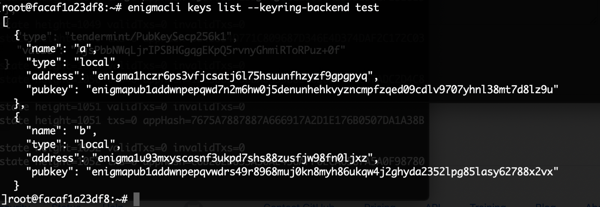

# enigma-secret-swap

Documentation for the test planning and implementation for the ENG to SCRT Burn! proposal created by SecretNodes.org: https://ipfs.io/ipfs/QmUvhWUYW1jpqjZSJjRKUB5y1RixuuvaD27Vbtgbvf1Kjm/Burn_ENG_for_SCRT-v1.pdf

This repo uses Git submodules to include the ENG to SCRT Unidirectional Swap Tooling and Enigma Blockchain with Tokenswap repositories. To clone and work with this repository for testing clone the repo using:

```
git clone --recurse-submodules https://github.com/lauraweindorf/enigma-secret-swap
```

For further information on working with a "Super Repository" that contains other repositories as sub-directories see [7.11 Git Tools - Submodules](https://git-scm.com/book/en/v2/Git-Tools-Submodules).

Information included:
- Resources
- Pre-conditions
- Test Plans (Dev, Testnet, Functional and Stress)
- Test Results

## Resources

- [Enigma Swap - Multisig Setup Proposal](https://hackmd.io/AY1XxpRsQey1E-qB3iSyVg)

Written by _ScotchFinance_, an Enigma Blockchain validator, this document outlines the components and workflow for the setup and implementation for the ENG to SCRT swap process.


- [ENG to SCRT Unidirectional Swap Tooling](https://github.com/levackt/scrt-swap)

Also, provided by _ScotchFinance_, with additional contribributions from Taariq Levack, this repo contains the UI front-end (for submitting user's swap request) and the code and contract responsible for coordinating the leader and operator actions resulting in the `Burn` request that's emitted for a valid swap request.

The token swap Leader and Operators are elected through an Enigma Blockchain Governance proposal prior, as outlined in the doc above (_Enigma Swap - Multisig Setup Proposal_). The proposal will outline the election of N operators and 1 leader, where the operators wait for a `Burn` event, process the transaction (adding their signature), and storing the transaction in a database. The Leader waits for the `Burn` event as well and creates an unsigned mutisig transaction and stores that in the database. When a `Burn` transaction in the database has M-of-N signatures, the Leader then creates the token swap transaction, stores in the database, and broadcasts the transaction to the validator nodes on the chain.

The `MultisigApproveAddress` used by the Leader is created via the proposal mentioned above.


- [Enigmacli Multisig Transactions](https://github.com/enigmampc/EnigmaBlockchain/blob/master/docs/enigmacli.md#multisig-transactions)

Some information on creating and using Multisig transactions on the Enigma Blockchain.


- [Enigma Blockchain Tokenswap](https://github.com/Cashmaney/enigmachain/tree/master/x/tokenswap)

Created by another Enigma Blockchain validator, _Cashmaney_, this is the repo that contains the actual SCRT minting code and is invoked by the Leader (above).

## Pre-conditions

### Governance Proposals

There are Enigma Blockchain governance proposals required before testing can be initiated (see Testnet section below).

There are Enigma Blockchain governance proposals required before the secret swap can be initiated on Mainnet (see Mainnet section below).

### Enigma Blockchain Release(s)

The Testnet and Mainnet releases of the Enigma Blockchain, including the `x/tokenswap` module, will require coordination and participation with the Enigma Core team.


### Questions to be Addressed

- [ ] There's a reference to a _genesis_ file in the tokenswap module. What do we need to do there?

- [ ] How will the Ethereum `Burn` contract be funded (for gas requirements) prior to enabling the token swap? We also need to determine how much ETH will be required.

- [ ] Will we need a Community Spend proposal to fund the `Burn` contract?

## Local Developer Testnet

### Setup

Clone the tokenswap repo:

```
git clone https://github.com/Cashmaney/enigmachain/tree/master/x/tokenswap
```

Build the docker container and run the local Enigma Blockchain:
```
docker build -f .\Dockerfile_build -t enigmachain .
```

The local devnet `enigmachain` is configured with the following addresses and transaction hashes:
```
Leader key: 

`MultisigApproveAddress`: enigma1n4pc2w3us9n4axa0ppadd3kv3c0sar8c4ju6k7

Operator a address: enigma1hczr6ps3vfjcsatj6l75hsuunfhzyzf9gpgpyq

Operator b address: enigma1u93mxyscasnf3ukpd7shs88zusfjw98fn0ljxz

Multisignature Threshold (N): 2

Burn transaction hash: 0xaaaaaaaaaaaaaaaaaaaaaaaaaaaaaaaaaaaaaaaaaaaaaaaaaaaaaaaaaaaaaaaa

Ethereum sender address: 0xbBbBBBBbbBBBbbbBbbBbbbbBBbBbbbbBbBbbBBbB

SCRT receiver address: enigma1yuth8vrhemuu5m0ps0lv75yjhc9t86tf9hf83z

```

### Run the Local Developer Testnet

#### Enigma Blockchain

Run the container:
```
docker run --name enigmachain -t enigmachain
```

**NOTE**: The enigmachain docker container can be stopped using `docker stop enigmachain` and re-started using `docker start -i enigmachain`.

In another terminal run a `bash` shell in the `enigmachain` container:
```
docker exec -it enigmachain /bin/bash
```

Check the keys:
```
enigmacli keys list --keyring-backend test
````



#### ENG to SCRT Unidirectional Swap Tooling

_In Progress ..._


## Testnet

### Setup

- [ ] Create Testnet release of _Cashmaney's_ enigma blockchain repo with the `x/tokenswap` module (`enigmablockchain_tokenswap_testnet`) - _TBD_

- [ ] Install `enigmablockchain_tokenswap_testnet` on Kamut - _Dan | ChainOfSecrets.org_

- [ ] Coordinate release installation and setup on Kamut with tokenswap participants - _Dan | ChainOfSecrets.org_

- [ ] Proposal to identify Leader and N Operators (N to be determined) - _SecretNodes.org_

- [ ] Coordinate creation of `MultisigApproveAddress` - _Leader and Operator participants_

- [ ] Proposal to approve the Leader's `MultisigApproveAddress` with information including all involved addresses and method of creation - _TBD_

- [ ] Proposal to set `MintingEnabled` to _true_ to turn on the actual token swap module - _TBD_

- [ ] Deploy ENG to SCRT Unidirectional Swap Tooling, including UI Burn Form - _TBD_

	(This should be deployed to a cloud platform capable of auto-scaling)

- [ ] Deploy ENG to SCRT Ethereum contract to Testnet (Kovan) and publish contract address - _TBD_

### Test Plan

#### Functional End-to-End Testing

1. Happy Path - one swap request for 10 ENG to SCRT
2. Happy Path - one swap request for 8,360,000 ENG to SCRT
3. Happy Path - one swap request for user with the most ENG on Binance
	
	Binance has almost 20,000 ENG wallets (viewed on 3/29/20)
	The largest holder of ENG is _Binance 7_ with almost 25,000,000 ENG

2. Valid ENG wallet address **not** owned by user
3. Invalid ENG wallet address
4. Valid SCRT wallet address **not** owned by user
5. Invalid SCRT wallet address
6. Invalid token swap amount (non-numeric, negative, non-integer)

_more TBD_

#### Security Testing

_TBD_

#### Stress/Load Testing

1. Identify stress testing tool
2. Identify ball park number of ENG hodlers 
2. Design load test configuration
3. Create load test script
4. Test load test with dry run
5. Run load test 
6. Analyze and report results

### Test Plan Results

_TBD_

## Token Swap Audit

- [ ] Conduct audit

- [ ] Address required changes for `enigmachain` token swap module

- [ ] Address required changes for ENG to SCRT Unidirectional Token Swap Tooling

- [ ] Re-run functional/end-to-end, security and stress tests


These activities will be run iteratively, if applicable.


## Mainnet (enigma-1)

### Governance Proposals

- [ ] Proposal to identify Leader and N Operators (N to be determined) - _SecretNodes.org_

- [ ] Proposal to approve the Leader's `MultisigApproveAddress` with information including all involved addresses and method of creation - _TBD_

- [ ] Coordinate creation of `MultisigApproveAddress` - _Leader and Operator participants_

- [ ] Proposal to set `MintingEnabled` to _true_ to turn on the actual token swap module - _TBD_

	_After release has been approved and installed on mainnet nodes_

### Deployment

- [ ] Initiate Pull Request to `https://github.com/enigmampc/EnigmaBlockchain` for token swap module - _Cashmaney_

- [ ] Review/approve token swap PR - _Enigma core team_

- [ ] Create Mainnet release of EnigmaBlockchain with approved PR `x/tokenswap` module (`enigmablockchain_tokenswap_testnet`) - _Enigma core team_

- [ ] Publish and coordinate release info for installation by validators - _Enigma core team_

- [ ] Deploy ENG to SCRT Unidirectional Swap Tooling - _TBD_

	(This should be deployed to a cloud platform capable of auto-scaling)

- [ ] Deploy ENG to SCRT Ethereum contract to Testnet (Kovan) and publish contract address - _TBD_

- [ ] MathWallet token swap front-end for dry-run is setup and made available to tester(s)

### Dry Run

- [ ] Tester conducts dry-run with mainnet ENG and verifies results

- [ ] Validator volunteers conduct dry-run ENG to SCRT swap

### ENG to SCRT Burn!

- [ ] Validators get ready for token swap requests (monitoring and such)

- [ ] Publish instructions for ENG hodlers that wish to swap their ENG to SCRT on various channels - _SecretNodes.org_

- [ ] Leader and Operators (validators) provide support for issues reported by users

