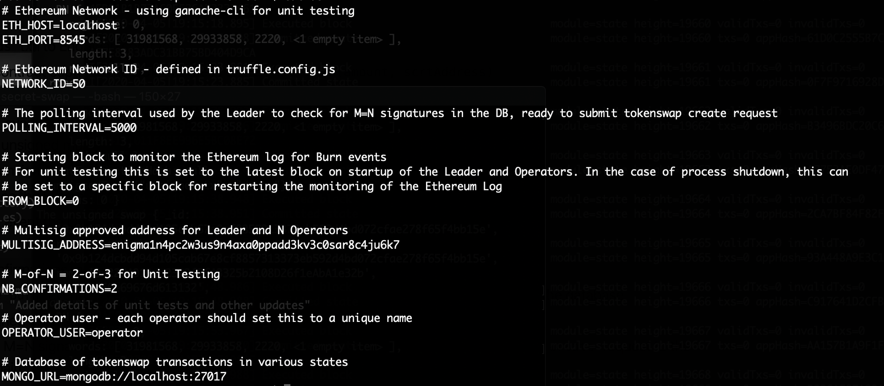

# enigma-secret-swap

## WiP

Test planning and implementation for the ENG to SCRT Burn! proposal created by SecretNodes.org: https://ipfs.io/ipfs/QmUvhWUYW1jpqjZSJjRKUB5y1RixuuvaD27Vbtgbvf1Kjm/Burn_ENG_for_SCRT-v1.pdf

## Repository

This repo uses Git submodules to include the ENG to SCRT Unidirectional Swap Tooling and Enigma Blockchain with Tokenswap repositories. To clone and work with this repository for testing clone the repo using:

```
git clone --recurse-submodules https://github.com/chainofsecrets/enigma-secret-swap
```

For further information on working with a "Super Repository" that contains other repositories as sub-directories see [7.11 Git Tools - Submodules](https://git-scm.com/book/en/v2/Git-Tools-Submodules).

## Resources

- [Enigma Swap - Multisig Setup Proposal](https://hackmd.io/AY1XxpRsQey1E-qB3iSyVg)

Written by _ScotchFinance_, an Enigma Blockchain validator, this document outlines the components and workflow for the setup and implementation for the ENG to SCRT swap process.


- [ENG to SCRT Unidirectional Swap Tooling](https://github.com/levackt/scrt-swap)

Also, provided by _ScotchFinance_, with additional contribributions from Taariq Levack, this repo contains the UI front-end (for submitting user's swap request) and the code and contract responsible for coordinating the leader and operator actions resulting in the `Burn` request that's emitted for a valid swap request.

The token swap Leader and Operators are elected through an Enigma Blockchain Governance proposal prior, as outlined in the doc above (_Enigma Swap - Multisig Setup Proposal_). The proposal will outline the election of N operators and 1 leader, where the operators wait for a `Burn` event, process the transaction (adding their signature), and storing the transaction in a database. The Leader waits for the `Burn` event as well and creates an unsigned mutisig transaction and stores that in the database. When a `Burn` transaction in the database has M-of-N signatures, the Leader then creates the token swap transaction, stores in the database, and broadcasts the transaction to the validator nodes on the chain.

The `MultisigApproveAddress` used by the Leader is created via the proposal mentioned above.


- [Enigmacli Multisig Transactions](https://github.com/enigmampc/EnigmaBlockchain/blob/master/docs/enigmacli.md#multisig-transactions)

Some information on creating and using Multisig transactions on the Enigma Blockchain.


- [Enigma Blockchain Tokenswap](https://github.com/Cashmaney/enigmachain/tree/master/x/tokenswap)

Created by another Enigma Blockchain validator, _Cashmaney_, this is the repo that contains the actual SCRT minting code and is invoked by the Leader (above).

- [Kamut Testnet Blockchain](https://github.com/ChainofSecrets.org/KamutBlockchain)

The Kamut testnet, created and operated by [ChainofSecrets.org](https://ChainofSecrets.org), has _Cashmaney's_ tokenswap module. This repo is used for local end-to-end testing as well as the planned testnet for the ENG to SCRT tokenswap.

## Disclaimer

This repository and submodules, including all smart contract and tokenswap chain components, has not been professionally audited and is not intended 
for use in a production environment. It is intended for testing **ONLY**. As such, users should **NOT** trust the system to securely hold mainnet 
funds. Any developers attempting to use _enigma-secret-swap_ as a base for their own ERC20 to Cosmos/SDK token swap will need to develop and audit their own implementation.


## Assumptions

### Governance Proposals

There are Enigma Blockchain governance proposals required before testing can be initiated (see Testnet section below).

There are Enigma Blockchain governance proposals required before the secret swap can be initiated on Mainnet (see Mainnet section below).

### Enigma Blockchain Release(s)

The Testnet release will be created from _Cashmaney's_ `enigmachain` repository. After successful testing _Cashmaney_ will submit a PR to the Enigma Blockchain repository for approval and merging: 

`https://github.com/enigmampc/EnigmaBlockchain`

The Enigma core team will create a Mainnet release for `enigma-1` containing the tokenswap module and will coordinate the installation and participation amongst validators.


### Token Swap Fees

The user pays the ETH gas per swap transaction. The estimated cost is under 24k to send ENG to the _burn_ contract address and an additional amount (under 50k) to approve the contract transfer for a total of < 50k gas.

The gas estimation will be included in the `scrt-swap` Burn Form UI to make it clear for users that don't use MetaMask. 

Only a bit of ETH (less than 0.01) wil be required to deploy the token swap contract.


# Test Plans

## Local Testnet Plan

### Setup

#### Enigma Blockchain

Change directory to the `enigmachain` tokenswap repo:

```
cd enigmachain
```

Build the docker container and run the local Enigma Blockchain:
```
docker build -f Dockerfile_node -t enigmachain .
```

The local devnet `enigmachain` is configured with the following addresses and transaction hashes:
```
Leader key: 

`MultisigApproveAddress`: enigma1n4pc2w3us9n4axa0ppadd3kv3c0sar8c4ju6k7

Operator a address: enigma1hczr6ps3vfjcsatj6l75hsuunfhzyzf9gpgpyq

Operator b address: enigma1u93mxyscasnf3ukpd7shs88zusfjw98fn0ljxz

Multisignature Threshold (N): 2

Burn transaction hash: 0xaaaaaaaaaaaaaaaaaaaaaaaaaaaaaaaaaaaaaaaaaaaaaaaaaaaaaaaaaaaaaaaa

Ethereum sender address: 0xbBbBBBBbbBBBbbbBbbBbbbbBBbBbbbbBbBbbBBbB

SCRT receiver address: enigma1yuth8vrhemuu5m0ps0lv75yjhc9t86tf9hf83z

```

#### ENG to SCRT Unidirectional Swap Tooling (scrt-swap)

`scrt-swap` consists of:

- Mongo database (run in docker)
- Smart contract (run in local blockchain)
- Leader and Operator components (Node.js)
- Dapp UI (react app)

Local test environment is:

- Truffle v5.1.20 (core: 5.1.20)
- Solidity v0.5.16 (solc-js)
- Node v11.15.0
- Web3.js v1.2.1
- Ganache CLI v6.9.1 (ganache-core: 2.10.2)

Install:

**NOTE**: the command below should be run under the `scrt-swap` directory.

```
$ yarn
```

### Run the Local Testnet

#### Enigma Blockchain

Run the container:
```
docker run --name enigmachain -t enigmachain
```

**NOTE**: The enigmachain docker container can be stopped using `docker stop enigmachain` and re-started 
using `docker start -i enigmachain`.

In another terminal run a `bash` shell in the `enigmachain` container:
```
docker exec -it enigmachain /bin/bash
```

Check the keys:
```
enigmacli keys list --keyring-backend test
````


#### ENG to SCRT Unidirectional Swap Tooling (scrt-swap)

Run the following commands from the `scrt-swap` directory.

Start the local ethereum blockchain:

```
$ ganache-cli -d -i 50

```

Run the `scrt-swap` database (in another terminal).

```
$ docker-compose run --service-ports mongo

```


Compile and deploy the smart contracts:

```
$ yarn migrate
```

The `EngToken` and `EngSwap` smart contracts are deployed


### Unit Tests

Run the `scrt-swap` unit tests:

```
$ yarn test
```

The scenarios covered by the unit tests include (for Ethereum accounts):

**NOTE**: For more detailed information see the [Enigma Swap - Multisig Setup Proposal](https://hackmd.io/AY1XxpRsQey1E-qB3iSyVg)

The Trust model uses M-of-N, where N is the # of Operators. For Unit Testing the M-of-N setting is 2-of-3. The Leader is not part of the M-of-N.

- Send `burnFunds` txn to EngSwap contract
- The EngSwap contract captures the SCRT address and emits a `Burn(amount, scrtAddress)`
- Leader process watches the Ethereum log for `Burn` events
- For each `Burn` event the Leader:
	- creates an unsigned multisig txn
	- stores the unsigned txn in the database with a key of `transactionHash`
- Operator watches the Ethereum log for `Burn` events
- For each `Burn` event the Operator (M)
	- waits for N confirmations
	- upon N confirmations, gets the unsigned txn from the database by `transactionHash`
	- verifies the `Burn` event attributes are correct by comparing with the unsigned txn retrieved from the database
	- if the unsigned txn is verified, the Operator signs and stores the signed txn in the database
- When a txn has M=N signatures in the database, the Leader signs the txn and submits the `tokenswap create` request to the Enigma Blockchain
- The Leader stores the `tokenswap create` txn in the database using the `transactionHash`
- The Enigma Blockchain validators participate in the minting of SCRT tokens to the specified `scrtAddress` by validating the multisig address and performing the mint


### Integration Testing

_TBD_: Should we have the Leader periodically poll the chain's REST API to get the transaction status or just to verify that the balance of the `scrtAddress` reflects the swap amount?

### Setup

**NOTE**: The Operator user name set in each leader/operator process should be set to the key alias used by the validator.

Add keys for the Operators and Leader:

```
$ enigmacli keys add a --keyring-backend test
$ enigmacli keys add b --keyring-backend test
$ enigmacli keys add c --keyring-backend test
$ enigmacli keys add leader --keyring-backend test
```


### Run Leader and Operators

For each of the 3 Operators and the 1 Leader, create an `<key>.env` file before starting the process and set the OPERATOR_USER to the key alias.




Start Operator a:

```
$ ROLE=operator node ./server.js
```

Start Operator b:

```
$ ROLE=operator node ./server.js
```

Start Operator c:

```
$ ROLE=operator node ./server.js
```

Start Leader:

```
$ ROLE=operator node ./server.js
```


Open Ethereum Remix: https://remix.ethereum.org and add the `EngToken.sol` and `EngSwap.sol` contracts. For the Integration testing done initially, we've modified the contracts in Remix to use the OpenZeppelin contracts in GitHub, which are using Solidity 0.6.0 so these modifications were necessary:


### Functional End-to-End Testing


### Burn Form UI


Setup and start the React app front-end:

**NOTE**: Run the following command from the `scrt-swap/client` directory.

Install dependencies:

```
$ yarn install
```

Start the react app, listening on `http://localhost:3000`:

```
$ yarn start
```

which opens a browser and displays the _UI Burn Form_.


### Test Scenarios

1. 
2. 

_TBD_


## Local Testnet Results

### Unit Tests

(4) PASSED


### Integration Tests

3. Start Operator process

	Getting periodic exceptions on `const currentBlock = await this.web3.eth.getBlockNumber()` in BurnWatcher:

		```
		Invalid JSON RPC Response ""
		```

FAILED

4. Set `fromBlock` to specific block to start at later block.

	`fromBlock` - 68
	
	Operator code rewound to `fromBlock` - N confirmations, which are set to 2 to get `toBock` = 66

	Using `getPastEvents` with `fromBlock: 68`, `toBlock: 66` results in _NaN_ exception

FAILED

5. Got duplicate key on insert in database.

	Not sure how I got into this situation, could've been due to running unit tests beforehand (?)

	Should add some handling if a duplicate key scenario occurs

FAILED


(3) Tests Failed.


### Functional End-to-End Testing

[ ] - Handle `fromBlock` setting in case the operator/leader process goes down (server reboot or some error) so it can be restarted.

	Recommendation: add another collection to MongoDB to keep track of the last block number and use that when restarting if the `fromBlock` .env setting is 0.
	

## Testnet (Rinkeby)

### Setup

- [x] Create Testnet release of _Cashmaney's_ enigma blockchain repo with the `x/tokenswap` module - _Dan | ChainOfSecrets.org_

- [x] Launch Kamut testnet release with tokenswap module - _Dan | ChainOfSecrets.org_

- [ ] Proposal to identify Leader and N Operators (N to be determined) - _Ian | SecretNodes.org_

	**UPDATE**: M-of-N setup is set at 2-of-3 for kamut.

- [ ] Coordinate creation of `MultisigApproveAddress` - _Leader and Operator participants_ - _Ian | SecretNodes.org_

	_In_Progress_

- [ ] Proposal to set tokenswap subspace parameters - _Ian | SecretNodes.org_

		`MultisigApproveAddress` : multisig address, for Leader and Operator participants
		`MintingEnabled` : _true_ to turn on the actual token swap module

	_In_Progress_

- [ ] Coordinate release installation and setup on Kamut with tokenswap participants - _Dan | ChainOfSecrets.org_

	**UPDATE**: Kamut testnet is up and running

	_Waiting on proposal to identify participants_

- [x] Deploy ENG to SCRT Unidirectional Swap contracts and UI - _Taariq_

	The EngToken and EngSwap contracts to Rinkeby. EngToken address is _______, EngSwap contract address is _______.
	UI which can be accessed here: [Secret IP]:5000


- [x] MathWallet Chrome extension for testnet - _Eric | MathWallet_ 

	Extension wallet guide: http://blog.mathwallet.org/?p=1096


### Integration Testing

**NOTE**: using Remix or Ethereum Studio

Enigma Token Contract Address (Rinkeby): 0xc0a1801ffa7cc2b126320ec6d2d99c024bd4e7fe

1. Happy Path - Token swap request
2. Token swap request initiated with invalid `MultisigApproveAddress`
3. Invalid parameters for token swap
4. ENG wallet address **not** owned by sender
5. SCRT wallet address **not** owned by receiver

### Functional End-to-End Testing

**NOTE**: using Burn Form UI and MathWallet

1. Happy Path - one swap request for 10 ENG to SCRT
2. Happy Path - one swap request for 8,360,000 ENG to SCRT
3. Happy Path - one swap request for user with the most ENG on Binance
	
	Binance has almost 20,000 ENG wallets (viewed on 3/29/20)
	The largest holder of ENG is _Binance 7_ with almost 25,000,000 ENG

4. Invalid ENG wallet address
5. Invalid SCRT wallet address
6. Invalid token swap amount (non-numeric, negative, non-integer)


_more TBD_

### Security Testing

1. Send with unauthorized MultisigApproveAddress

## Testnet Test Plan Results

_TBD_


# ENG to SCRT Burn! Audit

- [ ] Conduct audit - _Auditor_

- [ ] Address, if needed, changes for `enigmachain` token swap module

- [ ] Address, if needed, changes for ENG to SCRT Unidirectional Token Swap Tooling

- [ ] Run applicable tests


These activities will be run iteratively, if applicable.


# Mainnet (enigma-1) Plan

## Governance Proposals

- [ ] Proposal to identify Leader and N Operators (N to be determined) - _SecretNodes.org_

- [ ] Proposal to approve the Leader's `MultisigApproveAddress` with information including all involved addresses and method of creation - _TBD_

- [ ] Coordinate creation of `MultisigApproveAddress` - _Leader and Operator participants_

- [ ] Proposal to set `MintingEnabled` to _true_ to turn on the actual token swap module - _TBD_

	_After release has been approved and installed on mainnet nodes_

## Deployment

- [ ] Initiate Pull Request to `https://github.com/enigmampc/EnigmaBlockchain` for token swap module - _Cashmaney_

	**NOTE**: turn off `MintingEnabled` before submitting PR

- [ ] Review/approve token swap PR - _Enigma core team_

- [ ] Create Mainnet release of EnigmaBlockchain with approved PR `x/tokenswap` module (`enigmablockchain_tokenswap_testnet`) - _Enigma core team_

- [ ] Publish and coordinate release info for installation by validators - _Enigma core team_

- [ ] Deploy ENG to SCRT Ethereum contract to Ethereum Mainnet and publish contract address - _TBD_

- [ ] Deploy ENG to SCRT Unidirectional Swap Tooling - _TBD_

	(This should be deployed to a cloud platform capable of auto-scaling)

- [ ] MathWallet token swap front-end for dry-run is setup and made available to tester(s)

## Dry Run

- [ ] Tester conducts dry-run with mainnet ENG and verifies results

- [ ] Validator volunteers conduct dry-run ENG to SCRT swap

## ENG to SCRT Burn!

- [ ] Validators get ready for token swap requests (monitoring and such)

- [ ] Publish instructions for ENG hodlers that wish to swap their ENG to SCRT on various channels - _SecretNodes.org_

- [ ] Leader and Operators (validators) provide support for issues reported by users


**ENG to SCRT Burn! Complete**

## Contributors

- _Ian | SecretNodes.org_ - Project management and participation in ENG to SCRT Burn! tasks
- _Cashmaney_ - Tokenswap Enigma Blockchain codebase
- _ScotchFinance_ - ENG to SCRT Uniswap Tooling codebase, author of "Enigma Swap - Multisig Setup Proposal"
- _Taariq Lecvack_ - Tokenswap Enigma Blockchain and ENG to SCRT Uniswap Tooling and UI codebases
- _Eric | MathWallet_ - Enigma Dapp with SCRT wallet implementation, Chrome MathWallet extension
- _Dan Briggsie | Chain of Secrets_ - Kamut Testnet launch, Kamut REST API, SecretScan.io (block explorer)
- _Laura Weindorf | Chain of Secrets_ - Test planning, implementation and coordination

## Legal Disclaimer

THIS SOFTWARE IS PROVIDED BY THE CONTRIBUTORS "AS IS" AND ANY EXPRESS OR IMPLIED WARRANTIES, INCLUDING, BUT NOT LIMITED TO, THE IMPLIED WARRANTIES OF 
MERCHANTABILITY AND FITNESS FOR A PARTICULAR PURPOSE ARE DISCLAIMED. IN NO EVENT SHALL THE CONTRIBUTORS BE LIABLE FOR ANY DIRECT, INDIRECT, 
INCIDENTAL, SPECIAL, EXEMPLARY, OR CONSEQUENTIAL DAMAGES (INCLUDING, BUT NOT LIMITED TO, PROCUREMENT OF SUBSTITUTE GOODS OR SERVICES; LOSS OF USE, 
DATA, OR PROFITS; OR BUSINESS INTERRUPTION) HOWEVER CAUSED AND ON ANY THEORY OF LIABILITY, WHETHER IN CONTRACT, STRICT LIABILITY, OR TORT (INCLUDING 
NEGLIGENCE OR OTHERWISE) ARISING IN ANY WAY OUT OF THE USE OF THIS SOFTWARE, EVEN IF ADVISED OF THE POSSIBILITY OF SUCH DAMAGE.

## License

MIT
